<picture>
  <source media="(prefers-color-scheme: dark)"  srcset="assets/hero-dark.svg">
  <source media="(prefers-color-scheme: light)" srcset="assets/hero-light.svg">
  
</picture>

<!-- dateline:start -->`VOL. I` · `NO. 215` · `05 SEPTEMBER 2026` · `BUILT BY GITHUB ACTIONS`<!-- dateline:end -->

## &nbsp;⟡&nbsp; The ledger

<picture>
  <source media="(prefers-color-scheme: dark)"  srcset="assets/ledger-dark.svg">
  <source media="(prefers-color-scheme: light)" srcset="assets/ledger-light.svg">
  
</picture>

Most profiles are a showcase, where everything is a win. This one is a ledger, because
**two of my four projects are not wins** and hiding that would make the other two worth less.

| | Work | Verdict | The record |
|:--|:--|:--|:--|
| 🟣 | **A Regime-Aware Meta-Learning Framework for Selective Directional Trading in Cryptocurrency Markets** | `PEER-REVIEWED` | First author. Unsupervised temporal clustering identifies latent market regimes; a MAML-inspired meta-learned classifier then **abstains** instead of guessing under low confidence. IEEE ICIPTM 2026 · [`10.1109/ICIPTM69057.2026.11466047`](https://doi.org/10.1109/ICIPTM69057.2026.11466047) |
| 🟡 | **[Regime-Route](https://github.com/manavmax/Regime-Route)** · `C++20` `PostgreSQL` `Redis` `Next.js` | `FALSIFIED` | Proof-carrying execution — every routing decision emits a **hash-verifiable receipt**. Multi-tenant auth, idempotent order submission, TLS reverse proxy. Exercised against **13M+ real order-book rows** with paired counterfactual tests. Final conclusion: **no economically meaningful edge.** I published that instead of quietly reframing the goal. The receipts still work; so does the negative result. |
| 🟢 | **[Tensor-Forge](https://github.com/manavmax/Tensor-Forge)** · `C++20` `WGSL` `Next.js` | `SHIPPED` | A from-scratch JIT tensor compiler with **no PyTorch and no CUDA underneath** — it lowers and shape-specialises itself, and you can inspect every stage. **5/5 CTest suites passing**, full CI. |
| 🔵 | **[Bitcoin-Alpha-System](https://github.com/manavmax/Bitcoin-Alpha-System)** · `Python` `PyTorch` | `UNDER AUDIT` | In rebuild. Walk-forward and holdout validation are still running, so **there is no return figure on this page.** Publishing one now would be a claim I cannot defend yet. |

<samp><b>KEY</b> — `PEER-REVIEWED` external review passed · `SHIPPED` tested and running · `FALSIFIED` looked for the effect, did not find it, published anyway · `UNDER AUDIT` validation still running, nothing claimed until it clears</samp>

## &nbsp;⟡&nbsp; Selective signal

<picture>
  <source media="(prefers-color-scheme: dark)"  srcset="assets/tape-dark.svg">
  <source media="(prefers-color-scheme: light)" srcset="assets/tape-light.svg">
  
</picture>

This is the idea the paper is actually about, drawn rather than described. Cluster the tape into
latent regimes without labels, then let the classifier **decline to act** in the regime it cannot
call. A model that abstains 40% of the time and is right when it speaks beats one that always has
an opinion. **Schematic, not backtest output** — the shape is illustrative, the argument is not.

## &nbsp;⟡&nbsp; Upstream

<samp>THE PART OF THE RECORD I DID NOT GET TO GRADE MYSELF — COUNTED LIVE BY THE GITHUB SEARCH API</samp>
<!-- upstream:start -->
| Project | Maintained by | Where I worked | Merged |
|:--|:--|:--|--:|
| **[Gemini CLI](https://github.com/google-gemini/gemini-cli)** <!-- n:google-gemini/gemini-cli=2 --> | Google | `cli` `core` `extensions` `devtools` | `2` |
| **[Oppia](https://github.com/oppia/oppia)** <!-- n:oppia/oppia=2 --> | Oppia Foundation | LEAP team — led a Redis infrastructure upgrade | `2` |
| **[OpenMetadata](https://github.com/open-metadata/OpenMetadata)** <!-- n:open-metadata/OpenMetadata=1 --> | Collate | metadata platform | `1` |

<samp><b>5</b> pull requests merged by maintainers who owe me nothing · counted by the GitHub Search API on <code>2026-09-05</code>, not by me</samp>
<!-- upstream:end -->

The Oppia one is the one I would point at. The Redis upgrade was unglamorous infrastructure work
that was **failing CI for every other contributor** — which is exactly why it was worth doing.

## &nbsp;⟡&nbsp; Apparatus

<picture>
  <source media="(prefers-color-scheme: dark)"  srcset="assets/stack-dark.svg">
  <source media="(prefers-color-scheme: light)" srcset="assets/stack-light.svg">
  
</picture>

## &nbsp;⟡&nbsp; Telemetry

<picture>
  <source media="(prefers-color-scheme: dark)"  srcset="https://github-readme-activity-graph.vercel.app/graph?username=manavmax&bg_color=0B1120&color=F1F5F9&line=22D3EE&point=A78BFA&title_color=A78BFA&area=true&area_color=1E293B&hide_border=true&custom_title=Contribution%20activity">
  <source media="(prefers-color-scheme: light)" srcset="https://github-readme-activity-graph.vercel.app/graph?username=manavmax&bg_color=FFFFFF&color=0F172A&line=0891B2&point=7C3AED&title_color=7C3AED&area=true&area_color=F1F5F9&hide_border=true&custom_title=Contribution%20activity">
  
</picture>

<picture>
  <source media="(prefers-color-scheme: dark)"  srcset="https://github-readme-stats.vercel.app/api?username=manavmax&show_icons=true&hide_border=true&include_all_commits=true&count_private=true&bg_color=0B1120&title_color=A78BFA&text_color=94A3B8&icon_color=34D399&ring_color=22D3EE">
  <source media="(prefers-color-scheme: light)" srcset="https://github-readme-stats.vercel.app/api?username=manavmax&show_icons=true&hide_border=true&include_all_commits=true&count_private=true&bg_color=FFFFFF&title_color=7C3AED&text_color=475569&icon_color=059669&ring_color=0891B2">
  
</picture>
<picture>
  <source media="(prefers-color-scheme: dark)"  srcset="https://github-readme-stats.vercel.app/api/top-langs/?username=manavmax&layout=compact&langs_count=8&hide_border=true&bg_color=0B1120&title_color=A78BFA&text_color=94A3B8">
  <source media="(prefers-color-scheme: light)" srcset="https://github-readme-stats.vercel.app/api/top-langs/?username=manavmax&layout=compact&langs_count=8&hide_border=true&bg_color=FFFFFF&title_color=7C3AED&text_color=475569">
  
</picture>

<picture>
  <source media="(prefers-color-scheme: dark)"  srcset="assets/snake-dark.svg">
  <source media="(prefers-color-scheme: light)" srcset="assets/snake-light.svg">
  
</picture>

<samp>The two stat cards are the only things on this page served by someone else's server, so they are
the only things that can break. Everything above them is an SVG generated by a script in this repo.</samp>

## &nbsp;⟡&nbsp; Colophon

**Manav Sharma** — final-year B.Tech in Computer Science, Class of 2026, India.
Looking for research and systems work where the validation is taken as seriously as the model.

<samp>
Set in <b>Inter</b> and <b>JetBrains Mono</b>, with a system fallback stack — GitHub serves SVG under
<code>default-src 'none'</code>, so no webfont can be fetched and none is relied on. Every graphic
above is generated by <code>build/render.py</code> into paired light and dark plates and animated with
CSS <code>@keyframes</code> inside the SVG, which GitHub's CSP allows via <code>style-src 'unsafe-inline'</code>.
The dateline and the merge counts are rewritten daily by GitHub Actions between HTML-comment sentinels.
No JavaScript runs anywhere on this page; it cannot.
</samp>

<samp><b>ERRATA</b> — if a number here is wrong, open an issue. I would rather be corrected in public
than quoted incorrectly.</samp>
