<div align="center">

<picture>
  <source media="(prefers-color-scheme: dark)"  srcset="assets/ident-dark.svg">
  <source media="(prefers-color-scheme: light)" srcset="assets/ident-light.svg">
  
</picture>

<!-- dateline:start --><code>SESSION 2026-09-05</code> · <code>PLATES 14</code> · <code>RENDER build/render.py</code> · <code>CHECK build/verify.py</code> · <code>JS 0</code><!-- dateline:end -->

</div>

<picture>
  <source media="(prefers-color-scheme: dark)"  srcset="assets/blotter-dark.svg">
  <source media="(prefers-color-scheme: light)" srcset="assets/blotter-light.svg">
  
</picture>

Most profiles are a showcase, where every row is a win. This one is a blotter, so it has a
verdict column — and **two of the four verdicts are not wins.** That is the point. Hiding them
would make the other two worth less.

| | Work | Verdict | The record |
|:--|:--|:--|:--|
| `01` | **A Regime-Aware Meta-Learning Framework for Selective Directional Trading in Cryptocurrency Markets** | `PEER-REVIEWED` | First author. Unsupervised temporal clustering finds latent market regimes; a MAML-inspired meta-learned classifier then **abstains** rather than guess under low confidence. IEEE ICIPTM 2026 · [`10.1109/ICIPTM69057.2026.11466047`](https://doi.org/10.1109/ICIPTM69057.2026.11466047) |
| `02` | **[Regime-Route](https://github.com/manavmax/Regime-Route)** · `C++20` `PostgreSQL` `Redis` `Next.js` | `FALSIFIED` | Proof-carrying execution: every routing decision emits a **hash-verifiable receipt**. Multi-tenant auth, idempotent submission, TLS reverse proxy. Replayed against **13M+ real order-book rows** with paired counterfactuals. The honest, final conclusion was that **no economically meaningful edge was found** — 26 orders, −451.96 bps average edge, 38% win rate across $259,069,209 of paper notional. I published that instead of quietly reframing the goal. The receipts still work; so does the negative result. |
| `03` | **[Tensor-Forge](https://github.com/manavmax/Tensor-Forge)** · `C++20` `WGSL` `Next.js` | `SHIPPED` | A from-scratch JIT tensor compiler with **no PyTorch and no CUDA underneath** — it lowers and shape-specialises itself, and every stage is inspectable. **5/5 CTest suites passing**, full CI. |
| `04` | **[Bitcoin-Alpha-System](https://github.com/manavmax/Bitcoin-Alpha-System)** · `Python` `PyTorch` | `UNDER AUDIT` | Under active audit and rebuild. Walk-forward and holdout validation are still in progress, so **no performance number appears on this page and none should be stated as final.** Honest status: in progress, rebuilding under audit. |

<samp><b>KEY</b> — <code>PEER-REVIEWED</code> outside review passed · <code>SHIPPED</code> tested and running · <code>FALSIFIED</code> looked for the effect, did not find it, published anyway · <code>UNDER AUDIT</code> still validating, nothing claimed until it clears</samp>

<picture>
  <source media="(prefers-color-scheme: dark)"  srcset="assets/receipt-dark.svg">
  <source media="(prefers-color-scheme: light)" srcset="assets/receipt-light.svg">
  
</picture>

A receipt is only worth something if a stranger can check it. Every routing decision in
Regime-Route emits one, and anyone holding the same tape can recompute the digest and compare it
byte-for-byte — no trust in my log required. **That machinery works.** Pointed at 13M+ real
order-book rows with paired counterfactuals, it came back and said the effect is not there: the
honest, final conclusion was that **no economically meaningful edge was found.** That is a
feature, not a failure to hide — it is what validation discipline looks like when the answer is no.

<picture>
  <source media="(prefers-color-scheme: dark)"  srcset="assets/regime-dark.svg">
  <source media="(prefers-color-scheme: light)" srcset="assets/regime-light.svg">
  
</picture>

```
raw tape ──> temporal clustering ──> regime label ──┬──> confident ────────> take the position
                                                    │
                                                    └──> not confident ──> stand down, stay flat
```

This is what the paper argues, drawn rather than described. Cluster the tape into latent regimes
with no labels, then let the classifier **decline to act** in the regime it cannot call. The lower
lane is the part that makes it a rule rather than a slogan: the model's own confidence, with the
line it has to clear before a position is allowed. A model that stands down 29% of the time and is
right when it speaks beats one that always has an opinion. The plate is a **schematic of the rule,
not backtest output** — the shape is illustrative, the argument is not.

<picture>
  <source media="(prefers-color-scheme: dark)"  srcset="assets/forge-dark.svg">
  <source media="(prefers-color-scheme: light)" srcset="assets/forge-light.svg">
  
</picture>

No PyTorch and no CUDA underneath means the interesting claim is not that it runs — it is that
there is nothing below it doing the real work. A tensor graph is parsed, shape-specialised,
lowered, emitted as WGSL and dispatched, and **you can read what came out of every one of those
five stages.** 5/5 CTest suites, full CI. The plate is a schematic of the path a kernel takes, not
a map of the source tree.

### <samp>5 · UPSTREAM — THE PART OF THE RECORD I DID NOT GRADE MYSELF</samp>

<samp>COUNTED LIVE BY THE GITHUB SEARCH API, NOT BY ME</samp>
<!-- upstream:start -->
| Project | Maintained by | Where I worked | Merged |
|:--|:--|:--|--:|
| **[Gemini CLI](https://github.com/google-gemini/gemini-cli)** <!-- n:google-gemini/gemini-cli=8 --> | Google | `cli` `core` `extensions` `devtools` | `8` |
| **[Oppia](https://github.com/oppia/oppia)** <!-- n:oppia/oppia=10 --> | Oppia Foundation | LEAP team — led a Redis infrastructure upgrade | `10` |
| **[OpenMetadata](https://github.com/open-metadata/OpenMetadata)** <!-- n:open-metadata/OpenMetadata=1 --> | Collate | metadata platform | `1` |

<samp><b>19</b> pull requests merged by maintainers who owe me nothing · counted on <code>2026-09-05</code></samp>
<!-- upstream:end -->

The Oppia one is the one I would point at. The Redis upgrade was unglamorous infrastructure work
that was **failing CI for every other contributor** — which is exactly why it was worth doing.

<picture>
  <source media="(prefers-color-scheme: dark)"  srcset="assets/stack-dark.svg">
  <source media="(prefers-color-scheme: light)" srcset="assets/stack-light.svg">
  
</picture>

<picture>
  <source media="(prefers-color-scheme: dark)"  srcset="assets/keys-dark.svg">
  <source media="(prefers-color-scheme: light)" srcset="assets/keys-light.svg">
  
</picture>

<div align="center">

<a href="https://doi.org/10.1109/ICIPTM69057.2026.11466047"><kbd>F1</kbd> <samp>IEEE PAPER</samp></a> &nbsp;·&nbsp;
<a href="https://github.com/manavmax/Regime-Route"><kbd>F2</kbd> <samp>REGIME-ROUTE</samp></a> &nbsp;·&nbsp;
<a href="https://github.com/manavmax/Tensor-Forge"><kbd>F3</kbd> <samp>TENSOR-FORGE</samp></a> &nbsp;·&nbsp;
<a href="https://github.com/manavmax/Bitcoin-Alpha-System"><kbd>F4</kbd> <samp>BITCOIN-ALPHA</samp></a> &nbsp;·&nbsp;
<a href="https://www.linkedin.com/in/manavofficialdev"><kbd>F5</kbd> <samp>LINKEDIN</samp></a> &nbsp;·&nbsp;
<a href="mailto:manav.official.dev@gmail.com"><kbd>F6</kbd> <samp>EMAIL</samp></a>

</div>

### <samp>7 · COLOPHON</samp>

**Manav Sharma** — final-year B.Tech in Computer Science, Class of 2026, India. He/him.
Looking for research and systems work where the validation is taken as seriously as the model.
If a number on this page is wrong, open an issue: I would rather be corrected in public than
quoted incorrectly.

```
RENDER  build/render.py        ->  7 plates x 2 themes, drawn at 880px, which is GitHub's column width
CHECK   build/verify.py        ->  AA contrast on every ground · data colours separable · nothing under 9px
                                   in bounds · no baseline collisions · 2px of daylight between border and glyph
                                   no dangling url(#) · no external fetch · reduced-motion escape present
                                   every plate referenced, every reference real
LIVE    build/build_readme.py  ->  rewrites the dateline and the merge counts between HTML sentinels
FONTS   monospace, system stack.  GitHub serves SVG under default-src 'none', so no webfont can load.
MOTION  CSS @keyframes in the SVG. Allowed by style-src 'unsafe-inline'. No JavaScript runs here.
```

<samp>Every graphic above is generated by a script in this repository and served from it. Nothing on
this page is fetched from a third-party image service, which is why nothing on it can go missing.</samp>


